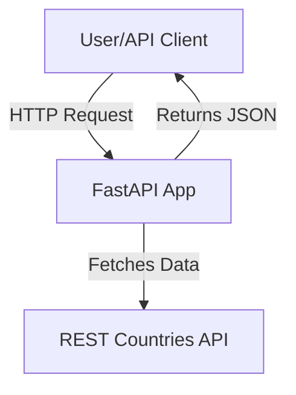

# African Capitals API

This project provides a simple REST API to retrieve the capital cities of African countries, grouped and ordered by their subregions (Northern, Western, Eastern, Southern, and Central Africa). The data is sourced in real-time from the free [REST Countries API](https://restcountries.com/).

## Features

- **/african-capitals**: Returns a list of African countries and their capitals, grouped by subregion.
- **/health**: Simple health check endpoint to verify the API is running.

## Architecture

- **FastAPI**: Lightweight, high-performance Python web framework for building APIs.
- **httpx**: Async HTTP client for fetching data from the REST Countries API.
- **Docker**: Containerization for easy deployment and reproducibility.

### Data Flow Diagram



## Usage

### Local Development

1. **Clone the repository**
    ```bash
    git clone <your-repo-url>
    cd <your-repo-directory>
    ```

2. **Create and activate a virtual environment**
    ```bash
    python3 -m venv venv
    source venv/bin/activate  # On Windows: venv\Scripts\activate
    ```

3. **Install dependencies**
    ```bash
    pip install -r requirements.txt
    ```

4. **Run the API**
    ```bash
    uvicorn main:app --reload
    ```

5. **Access the API**
    - Interactive docs: [http://localhost:8000/docs](http://localhost:8000/docs)
    - Health check: [http://localhost:8000/health](http://localhost:8000/health)
    - Capitals endpoint: [http://localhost:8000/african-capitals](http://localhost:8000/african-capitals)

### Docker

1. **Build the Docker image**
    ```bash
    docker build -t african-capitals-api .
    ```

2. **Run the container**
    ```bash
    docker run -p 8000:8000 african-capitals-api
    ```

## Endpoints

- `GET /african-capitals`  
  Returns African countries and their capitals, grouped by region.

- `GET /health`  
  Simple health check endpoint.

## License

This project is open source and free to use.